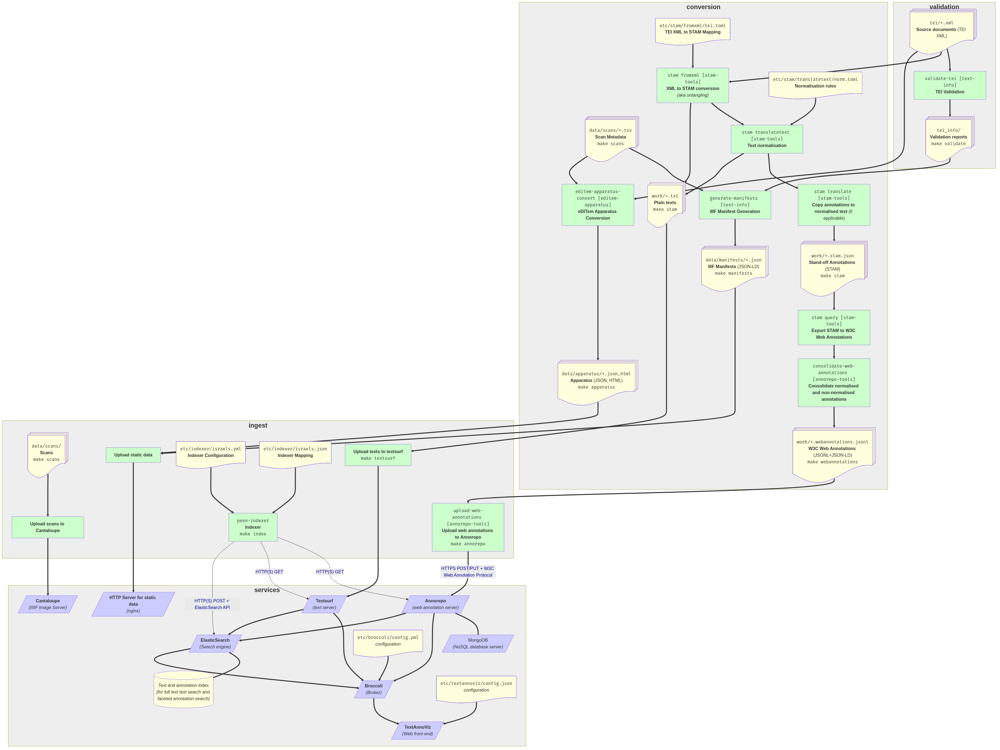

# Israels

Letters by Isaac Israels

## Architecture

The following schema schematically shows the technical architecture of the entire data processing pipeline:

#### Legend

* bold edges/arrows indicate data flow
* thin edges/arrows indicate caller direction
* square green boxes represent processes 
* squirely yellow boxes represent data 
* blue parallelograms represent services
